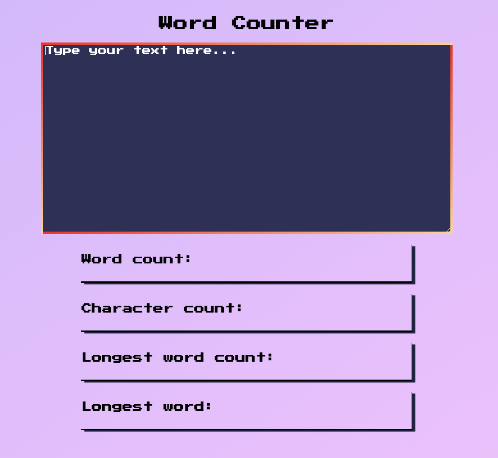

# A word counter that can count words, characters, and identify the longest word from user input.

## Table of contents

- [Overview](#overview)
  - [The goal](#the-goal)
  - [Screenshot](#screenshot)
- [My process](#my-process)
  - [Built with](#built-with)
  - [What I learned](#what-i-learned)
  - [Continued development](#continued-development)
  - [Useful resources](#useful-resources)
- [Author](#author)
- [Acknowledgments](#acknowledgments)

## Overview

### The goal

Users should be able to:

- [x] Count the words of their text.
- [x] Count the characters of their text.
- [x] Count the characters of their longest word.
- [x] Have their longest word identified.

### Screenshot

## My process

- I maintained high contrast ratios (13.1:1, 7.74:1) throughout the website, passing all WCAG tests. Tested using [WebAIM](https://webaim.org/resources/contrastchecker/?fcolor=000000&bcolor=16DFBD).

### Built with

- Semantic HTML5 markup
- CSS
- Flexbox
- JavaScript (ES6)
- Redux

### What I learned

- I learned how to utilize Regex to search for patterns.

### Continued development

I want to implement a paragraph counter, which calls for more advanced Regex knowledge.

### Useful resources

- [Nu Html Checker](https://validator.w3.org/nu/) - I ran my index.html through this conformance checker to catch any unintended mistakes.
- [CSS Validation Service](https://jigsaw.w3.org/css-validator/) - I ran my style.css through this conformance checker to catch any unintended mistakes.

## Author

- Website - [Coming soon!](#)
- GitHub - [@FredrikRidderfalk](https://github.com/FredrikRidderfalk)
- Twitter - [@Ridderfalk](https://twitter.com/Ridderfalk)

## Acknowledgments

My acknowledgements go out to the team at Scrimba. Enrolling in your courses made this project possible.
